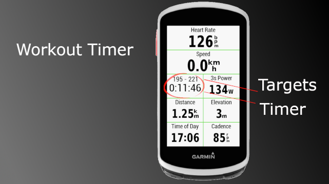

# Workout Timer

This datafield is a workout timer for Garmin Edge bike computers. It shows a timer and workouts targets.

Supported targets:

* Heart rate zones
* Heart rate high and low values
* Power high and low values
* Cadence high and low value
* During interval without set targets it will display 'workout timer'

## Installation

### Add it to your preferred screen

Menu - Activity profile - Your Profile - Data Screens - Layout - choose one - Double-tap where you want to place this Workout Timer - In 'Select a Category' - Connect IQ - select Workout Timer.
